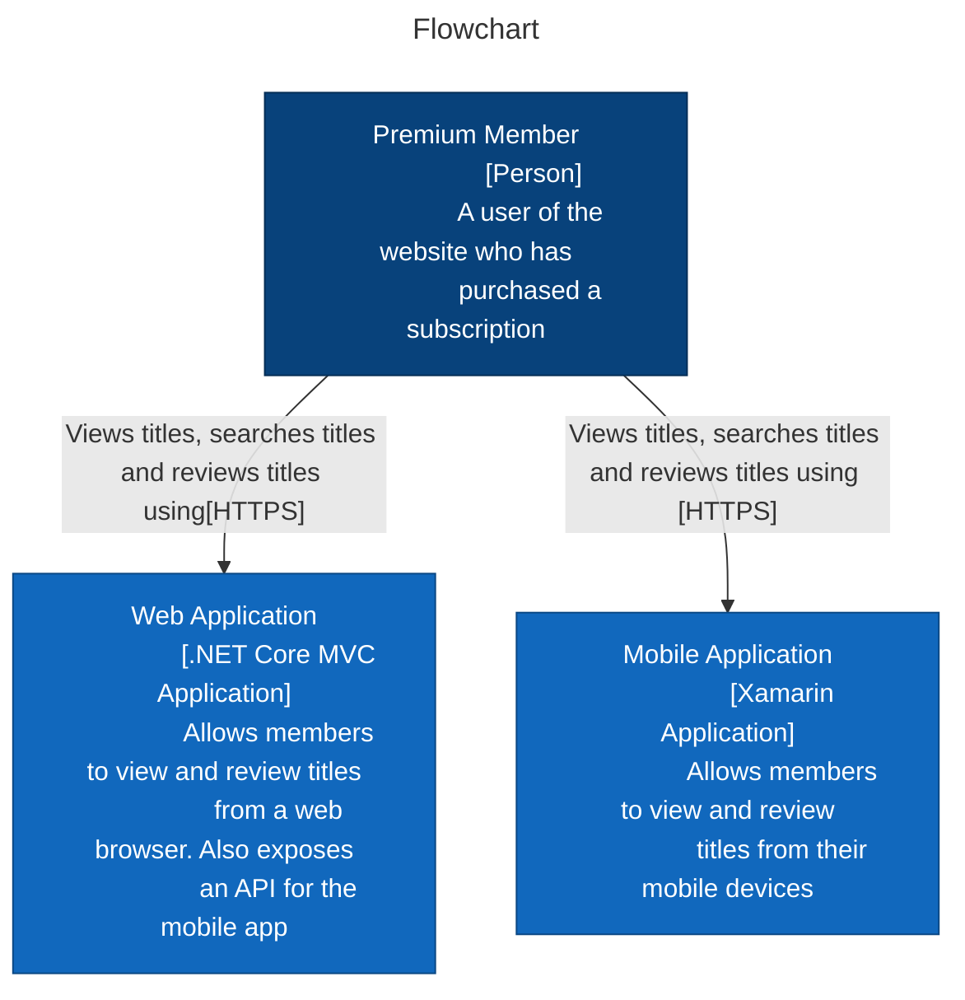

A C4 model is a set of hierarchical abstractions and hierarchical diagrams. The type of diagram used is **flowchart**.

The C4 model consists of four parts, with each part containing a different view of our system architecture and gradually increasing in detail as we move through the four parts.

The four parts are:
1. System Context
2. Container
3. Component
4. Code

Here their is no there’s no defined notation for creating C4 diagrams.

## System Context Diagram
It is the highest-level view,contains the minimal level of detail of our system architecture.

There are three main elements in a system context diagram:
1. People
2. Our software system (that we are designing)
3. Supporting software systems

A flowchart accepts four different ways of direction,they are:

1. TB(Top-to-Bottom)
2. BT(Bottom-to-Top)
3. LR(Left-to-Right)
4. RL(Right-to-Left)

Let's understand the workflow of a website(example: IMDb or Netflix)
#### Add Nodes:
Adding node is nothing but listing out the main user/objects of this website.

**Code:**

	flowchart TB
		User["Premium Member
		[Person]
		A user of the website who has\npurchased a subscription"]
		LS["Listings Service
		[Software System]
		Serves web pages displaying title
		listings to the end user"]

#### Connecting Nodes
We can connect our two nodes in a flowchart using a variety of arrows, but for a system context diagram we just need simple solid arrowheads that show dependencies or interactions.

**Example:**

		User-- "Views titles, searches title using" -->LS

**Code:**

	---
	title: "Listing Service C4 Model: System Context"
	---
	flowchart TD
	User["Premium Member
	[Person]
	A user of the website who has
	purchased a subscription"]
	LS["Listings Service
	[Software System]
	Serves web pages displaying title
	listings to the end user"]
	TS["Title Service
	[Software System]
	Provides an API to retrieve
	title information"]
	
	SS["Search Service
	[Software System]
	Provides an API to search
	for titles"]
	
	User-- "Views titles, searches titles using" -->LS
	LS-- "Retrieves title information from" -->TS
	LS-- "Searches for titles using" -->SS
	
	classDef focusSystem fill:#1168bd,stroke:#0b4884,color:#ffffff
	classDef supportingSystem fill:#666,stroke:#0b4884,color:#ffffff
	classDef person fill:#08427b,stroke:#052e56,color:#ffffff
	class User person
	class LS focusSystem
	class TS,SS supportingSystem

![[s-c.png]]

Here,

	classDef focusSystem fill:#1168bd,stroke:#0b4884,color:#ffffff
	classDef supportingSystem fill:#666,stroke:#0b4884,color:#ffffff
	classDef person fill:#08427b,stroke:#052e56,color:#ffffff
	class User person
	class LS focusSystem
	class TS,SS supportingSystem

This part adds colour to the diagram boxes to enhance the visual appeal of the diagram.

## Container Diagram
It gives the technical details of the system’s architecture.It still don't show actual code of any of the containers.It helps to understand the target architecture.

For our example of displaying title listings to the user, three containers are in play:
* A mobile application for mobile users
* A web application that serves web browsers and also hosts an API for the mobile app to retrieve/send data to/from
* A Redis instance for caching, to prevent repeated API calls to downstream services, such as the title service

**Code:**

	---
	title: "Listing Service C4 Model: System Context"
	---
	flowchart TD
	User["Premium Member
	[Person]
	A user of the website who has
	purchased a subscription"]
	
	WA["Web Application
	[.NET Core MVC Application]
	Allows members to view and review titles
	from a web browser. Also exposes
	an API for the mobile app"]
	
	MA["Mobile Application
	[Xamarin Application]
	Allows members to view and review
	titles from their mobile devices"]
	
	User-- "Views titles, searches titles and reviews titles using[HTTPS]" -->WA
	
	User-- "Views titles, searches titles and reviews titles using [HTTPS]" -->MA
	
	classDef container fill:#1168bd,stroke:#0b4884,color:#ffffff
	classDef person fill:#08427b,stroke:#052e56,color:#ffffff
	
	class User person
	class WA,MA container

>[!NOTE]
>() -> makes diagram to look like cylinder boxes.
>(start) or (end) -> gives start/end in circle
>{} -> gives decision box

## Component & Code
**Component** in C4 is equivalent of a high-level namespace
or module, or some sort of library or package that’s included in the container. Each container has component and each component has code.

